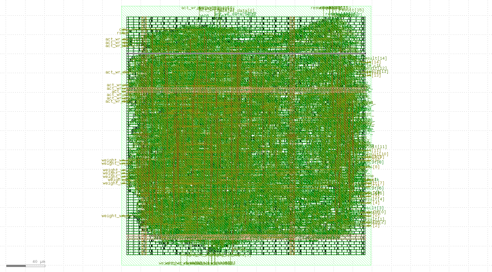
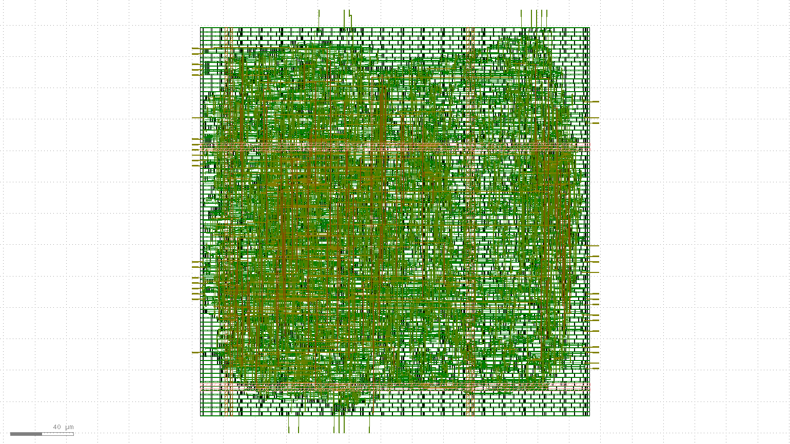
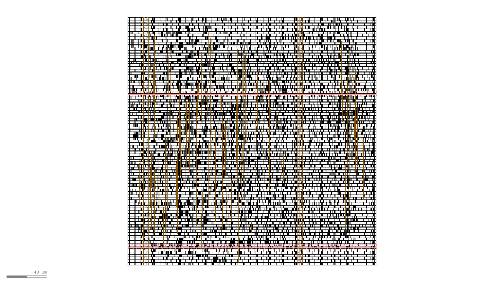
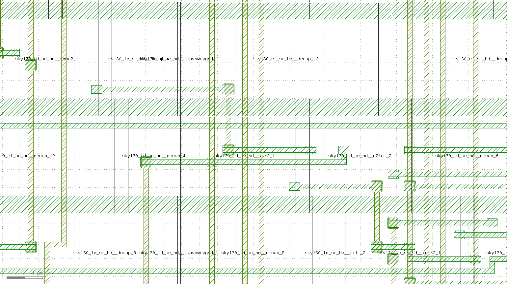
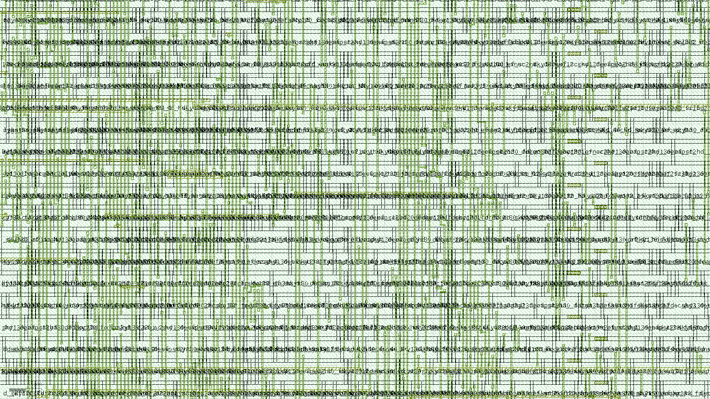

<div align="center">

# SiliconNPU

**RTL-to-GDS Physical Design of a Neural Processing Unit**

*Built entirely with open-source ASIC tools on SkyWater 130nm*

[](https://opensource.org/licenses/MIT)
[](https://skywater-pdk.github.io/)
[](https://github.com/The-OpenROAD-Project/OpenLane)
[](https://www.accellera.org/standards/systemverilog)

</div>

---

## Introduction

SiliconNPU is a complete chip design project — from SystemVerilog RTL to manufactured layout (GDSII) — built entirely with free, open-source tools. The design is a configurable Neural Processing Unit featuring a MAC array, weight memory, activation memory, and controller FSM, implemented on SkyWater's 130nm open PDK.

The project demonstrates the full physical design flow: RTL design, functional verification, synthesis, floorplanning, placement, clock tree synthesis, routing, and signoff — all using open-source tools.

## Key Features

- **Complete NPU Architecture**: 4×4 MAC array with weight/activation memory banks and a 3-state controller FSM (IDLE → COMPUTE → DONE)
- **Three Design Variants**: Basic MAC, Pipelined MAC, and full SiliconNPU — each with full physical design results
- **Timing Closure**: WNS = 0.00 ns, TNS = 0.00 ns achieved at 20 ns clock period (50 MHz)
- **Clean Signoff**: All three variants pass DRC (0 violations) and LVS (0 errors)
- **Automated Tooling**: Python CLI for synthesis, design space exploration, PPA analysis, and HTML dashboard generation
- **Comprehensive Verification**: 14 simulation tests across all designs (4 NPU + 5 Basic + 5 Pipelined), all passing

## Architecture

```
                    ┌─────────────────────────────┐
                    │      Controller FSM          │
                    │   IDLE → COMPUTE → DONE_S    │
                    └──────────┬──────────────────┘
                               │
              ┌────────────────┼────────────────┐
              │                │                │
     ┌────────▼──────┐ ┌──────▼───────┐ ┌──────▼───────┐
     │  Weight Memory │ │    MAC Array │ │ Act. Memory  │
     │    4×4 × 8-bit │ │  4 parallel  │ │   4×4 × 8-bit│
     │   (row, col)   │ │  multipliers │ │  (row, col)  │
     └────────┬──────┘ └──────┬───────┘ └──────┬───────┘
              │                │                │
              └────────────────┼────────────────┘
                               │
                    ┌──────────▼──────────┐
                    │    26-bit Accumulator │
                    │    result[25:0]       │
                    └─────────────────────┘
```

For each row `r`: `result += Σ(act[r][i] × weight[r][i])` for `i` in `0..3`

## Results

### Physical Design Summary

| Variant | Clock | WNS | TNS | Setup Slack | Hold Slack | Power (typ) | Core Area | Cells | DRC | LVS |
|---------|-------|-----|-----|-------------|------------|-------------|-----------|-------|-----|-----|
| MAC Basic (W8/A4) | 15 ns | 0.00 ns | 0.00 ns | +1.28 ns | +0.12 ns | 0.45 mW | 14,424 um² | 690 | Clean | Clean |
| MAC Pipelined (W8/A4) | 10 ns | -0.47 ns | -0.81 ns | -0.47 ns | +0.12 ns | 1.04 mW | 15,655 um² | 715 | Clean | Clean |
| **SiliconNPU (W8/A4/D4)** | **20 ns** | **0.00 ns** | **0.00 ns** | **+0.89 ns** | **+0.12 ns** | **12.3 mW** | **61,256 um²** | **2,856** | **Clean** | **Clean** |

### Simulation Results

| Design | Tests | Pass | Fail | Status |
|--------|-------|------|------|--------|
| SiliconNPU | 4 (identity, zeros, max, weighted sum) | 4 | 0 | ALL PASS |
| MAC Basic | 5 (accumulation, zeros, max, single, zero flag) | 5 | 0 | ALL PASS |
| MAC Pipelined | 5 (ones, zeros, max, weighted sum, mixed) | 5 | 0 | ALL PASS |

### NPU PPA Breakdown

| Metric | Value |
|--------|-------|
| Clock period | 20 ns (50 MHz) |
| Die area | 0.070 mm² |
| Core utilization | 55.3% |
| Total cells | 2,856 |
| Wire length | 88,970 um |
| Vias | 23,904 |
| Critical path | 6.15 ns |

### Layout Screenshots

**Full chip — all layers:**


**Metal routing (M1–M5):**


**Power grid (M4 + M5):**


**Cell placement — zoomed standard cells with poly gates:**


**Signal routing (M2–M3) with vias:**


---

## Installation & Setup

### Prerequisites

- WSL2 (Ubuntu 22.04+) or Linux
- Docker (for OpenLane/PDK)
- iverilog (for simulation)

### Simulation

```bash
# NPU (4 tests)
iverilog -g2012 -o npu_tb.vvp verification/silicon_npu_tb.sv rtl/silicon_npu.sv
vvp npu_tb.vvp

# MAC Basic (5 tests)
iverilog -g2012 -o mac_tb.vvp verification/mac_core_tb.sv rtl/mac_core.sv
vvp mac_tb.vvp

# MAC Pipelined (5 tests)
iverilog -g2012 -o mac_pipe_tb.vvp verification/mac_core_pipelined_tb.sv rtl/mac_core_pipelined.sv
vvp mac_pipe_tb.vvp
```

### Full Backend (RTL → GDS)

```bash
# In Docker container with PDK
export PDK_ROOT=/opt/pdk
flow.tcl -design flow -tag silicon_npu
```

---

## Repository Structure

```
SiliconNPU/
├── rtl/                            RTL sources
│   ├── silicon_npu.sv              Neural Processing Unit
│   ├── mac_core.sv                 Basic MAC accelerator
│   └── mac_core_pipelined.sv       Pipelined MAC variant
├── verification/                   Testbenches
│   ├── silicon_npu_tb.sv           NPU testbench (4/4 pass)
│   ├── mac_core_tb.sv              MAC testbench (5/5 pass)
│   └── mac_core_pipelined_tb.sv    Pipelined testbench (5/5 pass)
├── flow/                           Physical design flow
│   ├── Makefile                    Yosys synthesis targets
│   ├── config.tcl                  Active OpenLane config
│   ├── src/                        RTL copies for OpenLane
│   └── openlane_config/            Variant configs (15ns, 20ns)
├── results/                        GDS output files
│   ├── silicon_npu/                NPU GDS (8.4 MB)
│   ├── mac_basic/                  MAC Basic GDS (2.6 MB)
│   └── mac_pipe/                   MAC Pipelined GDS (2.6 MB)
├── screenshots/                    KLayout layout screenshots
├── openmac/                        Python tooling
├── scripts/                        Utility scripts
├── docs/                           Documentation
├── openmac.py                      CLI orchestrator
├── run_tests.py                    Test runner
└── Makefile                        Top-level targets
```

---

## Design Parameters

| Parameter | Default | Range | Description |
|-----------|---------|-------|-------------|
| WIDTH | 8 | 4-16 | Operand bit width |
| ARRAY_SIZE | 4 | 2-8 | Number of parallel MAC units |
| DEPTH | 4 | 2-16 | Number of rows in memory |

## Tool Chain

| Stage | Tool | Purpose |
|-------|------|---------|
| Simulation | iverilog 12.0 | RTL verification |
| Synthesis | Yosys 0.38 | RTL → gate-level netlist |
| Backend | OpenLane 1.1.1 | Floorplan → Place → CTS → Route → STA |
| DRC | Magic | Design rule checking |
| LVS | Netgen | Layout vs schematic |
| PDK | SkyWater SKY130A | 130nm standard cell library |

---

## Documentation

- [User Guide](docs/user_guide.md) — usage, CLI reference
- [Installation Guide](docs/install_guide.md) — WSL2 + Docker setup
- [Developer Guide](docs/developer_guide.md) — architecture, conventions
- [Final Report](docs/final_report.md) — full project report with results

## Author

**Ansh Verma**

## License

MIT
